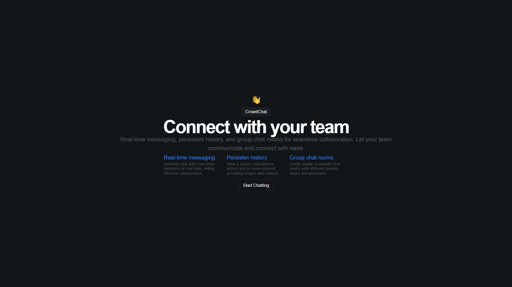
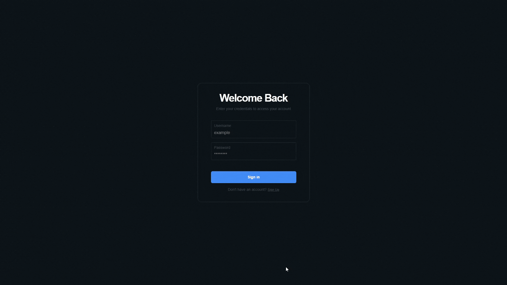
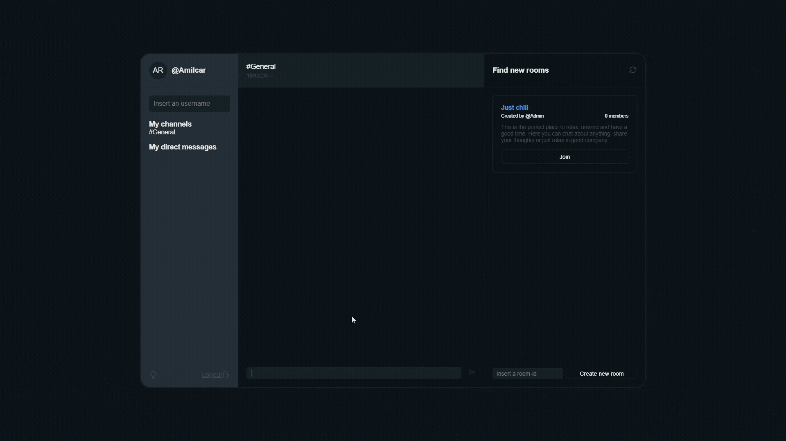
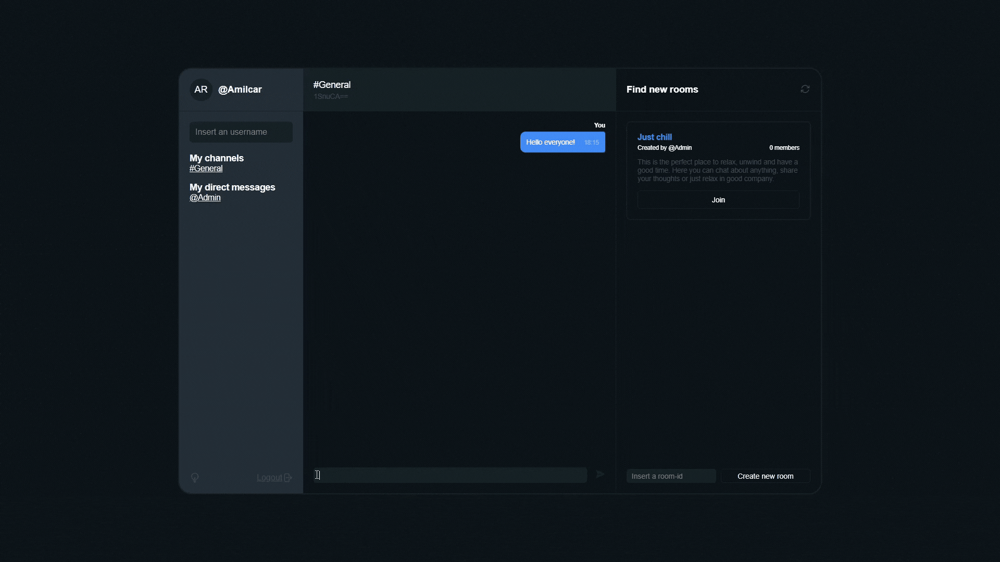

# Crowdchat

**Crowdchat** is a web application primarily focused on real-time group chats, but also includes direct messaging functionality. Various secure techniques are implemented to ensure user privacy and data integrity.



---

## Features

* **Register and Login:** Like any other web chat, you need to create an account to interact with other users.


* **Group Chats:** You can join or create public or private rooms. The key difference is how users join these rooms.

    * **Public Rooms:** Users can search through the public room window or join directly using a room code.
    

    * **Private Rooms:** Access is only possible via the room code.
    

* **Direct Chats:** If you want to chat with a single user, you can use the username search. Simply enter the username of the person you want to chat with, and if the username exists, you will be redirected to a new chat.


* **Interface:** Crowdchat is accessible on both PC and smartphones. Additionally, you can choose between dark mode or light mode.


## How to Run
First of all, it is necessary to know that this application only runs using the https protocol, due to the various security measures that have been implemented to protect the information that transits the network. It can be run without any problem by viewing it at http://localhost:3000/, but if you try to access it using an ip address, then the application will not run properly.

### Steps:
1. **Install Node.js:** The backend of Crowdchat runs on Node.js, so you need to install it. You can do this using [nvm](https://github.com/nvm-sh/nvm) and following the instructions provided in the repository.

2. **MySQL Database:** Crowdchat stores messages, room information, and more in a MySQL database. I used [XAMPP](https://www.apachefriends.org/es/download.html) to launch and configure the database. The database name can be anything, but you will need to specify it in the *.env* file. Create the following tables in your database:

```SQL
CREATE TABLE IF NOT EXISTS users (
    username VARCHAR(15) NOT NULL PRIMARY KEY,
    password VARCHAR(255) NOT NULL
); 

CREATE TABLE IF NOT EXISTS rooms ( 
    id VARCHAR(8) PRIMARY KEY,
    name VARCHAR(255) NOT NULL,
    description TEXT,
    creator VARCHAR(50),
    private BOOLEAN NOT NULL,
    FOREIGN KEY (creator) REFERENCES users(username)
); 

CREATE TABLE IF NOT EXISTS personal_room (
     id VARCHAR(101) PRIMARY KEY,
     user_id_1 VARCHAR(50) NOT NULL,
     user_id_2 VARCHAR(50) NOT NULL,
     UNIQUE KEY (user_id_1, user_id_2),
     FOREIGN KEY (user_id_1) REFERENCES users(username),
     FOREIGN KEY (user_id_2) REFERENCES users(username)
); 

CREATE TABLE IF NOT EXISTS room_messages (
    id INT AUTO_INCREMENT PRIMARY KEY,
    room_id VARCHAR(8) NOT NULL,
    sender VARCHAR(50) NOT NULL,
    message TEXT,
    pos INT NOT NULL,
    htime TIME, FOREIGN KEY (room_id) REFERENCES rooms(id),
    FOREIGN KEY (sender) REFERENCES users(username)
); 
    
CREATE TABLE IF NOT EXISTS personal_messages (
     id INT AUTO_INCREMENT PRIMARY KEY,
     chat_id VARCHAR(101) NOT NULL,
     sender VARCHAR(50) NOT NULL,
     message TEXT,
     pos INT NOT NULL,
     htime TIME,
     FOREIGN KEY (chat_id) REFERENCES personal_room(id),
     FOREIGN KEY (sender) REFERENCES users(username)
); 

CREATE TABLE IF NOT EXISTS room_participants (
    id INT AUTO_INCREMENT PRIMARY KEY,
    user_id VARCHAR(50) NOT NULL,
    room_id VARCHAR(8) NOT NULL,
    FOREIGN KEY (user_id) REFERENCES users(username),
    FOREIGN KEY (room_id) REFERENCES rooms(id),
    UNIQUE KEY (user_id, room_id)
);
```

3. **.env Configuration:** Sensitive configurations are encapsulated in a .env file. Create a new .env file in the server directory with the following variables:

```javascript
PORT = 
SESSION_SECRET =  
JWT_SECRET = 
DB_NAME = 
```

4. **installation:** After completing the above steps, install all Node.js dependencies using `npm install`. Then, start the server using `npm run start`, or if you want to make changes while the application is running, use `npm run dev`. Ensure your database is running and configured as described.

## Tech Stack

### Front-End
- **Languages:**
  - HTML
  - CSS
  - JavaScript

### Back-End
- **Languages:**
  - JavaScript

- **Libraries and Frameworks:**
  - Express: A web framework for Node.js applications.
  - MySQL: A client library for MySQL in Node.js.
  - Socket.io: A JavaScript library for real-time web applications.
  - jsonwebtoken: A JSON Web Token implementation for Node.js.
  - helmet: A set of functions that secure Express apps by setting various HTTP headers.
